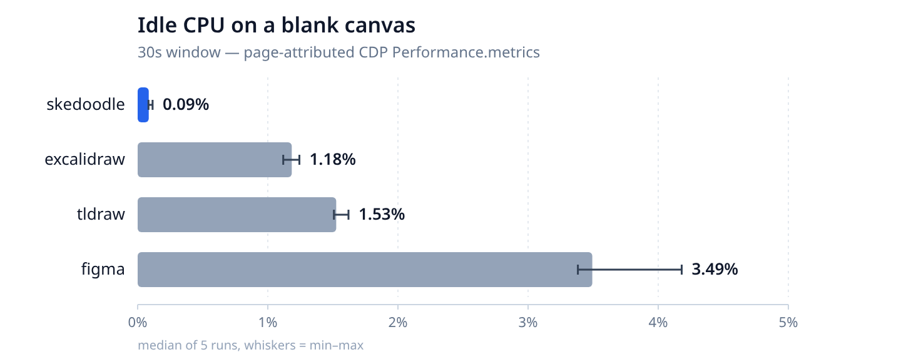
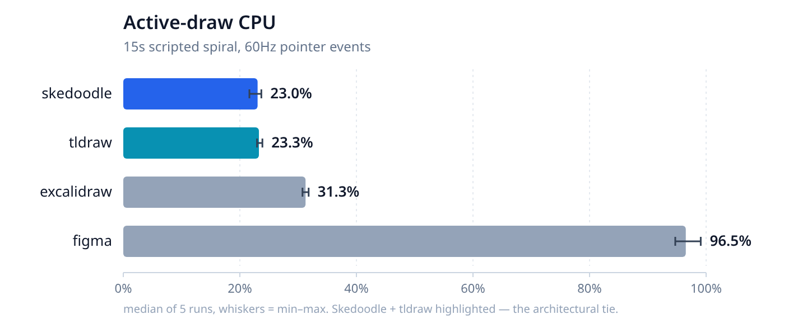

# Why your drawing app uses 2.5% CPU when you're not using it

*A measured comparison of Skedoodle, tldraw, Excalidraw, and Figma — and the one config flag that makes the difference.*

---

Open your browser. Go to any drawing or whiteboarding app — tldraw, Excalidraw, Figma, whatever you use. Put it on a blank canvas. Don't touch anything.

Open your browser's task manager.

That app is probably using **1–3% CPU** right now. Not the browser as a whole. Not all your tabs combined. Just that one page, sitting there, doing nothing visible. Multiply across every "modern web app" tab you keep open, and you start to understand why your fan spins up when you're not using the computer.

I've been building a drawing app called [Skedoodle](https://skedoodle.top). Its idle CPU is effectively zero. That's not an optimization — it's one architectural choice that falls out of one config flag. I wanted to see how it actually compared, on the clock, to the apps it's competing with.

Here's the result:



Skedoodle sits at the measurement noise floor. The other three pay a tax. This post is about *why* — and what you give up to avoid it.

---

## Methodology in one paragraph

I built a small [Playwright-based perf framework](https://github.com/eugenioenko/skedoodle/tree/chore/perf-plan/perf) that opens each app in Chromium, sits on a blank canvas for 30 seconds, and samples Chrome DevTools Protocol `Performance.metrics` every 500ms. The reported "CPU%" is `ΔTaskDuration / wall_clock`, attributed to the **page** — not the whole browser process. Median of 5 runs; whiskers on the chart are min–max. Machine: Microsoft Surface, Intel Core i5-1035G7, 8 cores, Arch Linux. The [full methodology and raw data](https://github.com/eugenioenko/skedoodle/blob/chore/perf-plan/perf_results.md) are in the repo. `pnpm --filter skedoodle-perf baseline` reproduces every number in this post.

---

## Why tldraw pays 1.5% CPU for nothing

tldraw ships a component called `TickManager`. It does what the name suggests — runs forever. [Here's the relevant code](https://github.com/tldraw/tldraw/blob/main/packages/editor/src/lib/editor/managers/TickManager/TickManager.ts):

```typescript
start() {
  this.isPaused = false
  this.cancelRaf?.()
  this.cancelRaf = throttleToNextFrame(this.tick)
  this.now = Date.now()
}

@bind
tick() {
  if (this.isPaused) { return }
  const now = Date.now()
  const elapsed = now - this.now
  this.now = now
  this.editor.inputs.updatePointerVelocity(elapsed)
  this.editor.emit('frame', elapsed)
  this.editor.emit('tick', elapsed)
  this.cancelRaf = throttleToNextFrame(this.tick)   // re-arm for next frame
}
```

The pattern is classic: every frame (60Hz), run `tick`, re-schedule yourself via `requestAnimationFrame`. No dirty-flag guard. No "skip if nothing changed." It ticks.

And the tick does work. It updates pointer velocity even if the pointer hasn't moved. It drains an event queue that might be empty. It fires `'frame'` and `'tick'` to anyone listening. The listeners then do work of their own: viewport and camera animation checks, scribble handlers (no-op when idle, but still a function call), and a `PerformanceManager._onFrame` that computes `getCulledShapes()` on every single frame whether anyone asked for it or not.

Multiply 60 ticks per second by half a millisecond of work each and you get, well, ~1.5% CPU.

A comment in the `TickManager` source file says it plainly: *"the tick manager since it sets up a raf loop."* They know.

---

## Excalidraw's subtler sin

Excalidraw does **not** run a perpetual rAF. Their `throttleRAF` helper is pull-based — only schedules when called:

```typescript
export const throttleRAF = <T extends any[]>(fn: (...args: T) => void) => {
  let timerId: number | null = null;
  let lastArgs: T | null = null;
  const scheduleFunc = () => {
    timerId = window.requestAnimationFrame(() => {
      timerId = null;
      const args = lastArgs;
      lastArgs = null;
      if (args) { fn(...args); }
    });
  };
  // ...
};
```

And their [`AnimationController`](https://github.com/excalidraw/excalidraw/blob/master/packages/excalidraw/renderer/animation.ts) explicitly stops itself when there's nothing left to animate:

```typescript
if (AnimationController.animations.size === 0) {
  AnimationController.isRunning = false;
  return;   // loop stops here when idle
}
```

So where does Excalidraw's 1.18% idle CPU go? **React.**

Excalidraw's `componentDidUpdate` runs a ~160-line prev/next diff on every state transition, commits to its store, fires `onChange` listeners, toggles theme classes, and more. The reconciler doesn't wake up from nothing — it wakes up because internal state is churning: hover tracking, current-tool state, pointer position all stored in component state. Each `setState` triggers a commit-phase diff.

It's a different shape of problem from tldraw's — not a perpetual rAF, but a steady drip of React work — and it lands at roughly the same cost. Something is waking up the main thread on a steady cadence, and the per-wake work isn't zero.

---

## Skedoodle's 0.09%

Skedoodle is built on [Two.js](https://two.js.org), a thin 2D renderer. Two.js's default, out of the box, is its own internal `requestAnimationFrame` loop — the `autostart: true` option. Enable it, and Two.js will call `update()` every frame for you, forever. If I'd left it on, Skedoodle would measure about the same as tldraw.

The first line of Skedoodle's canvas setup turns it off. [`client/src/canvas/canvas.hook.tsx`](https://github.com/eugenioenko/skedoodle/blob/main/client/src/canvas/canvas.hook.tsx):

```typescript
return new Two({
  autostart: false,   // ← the thesis, in one config flag
  fitted: true,
  width: container.clientWidth,
  height: container.clientHeight,
  type: twoType,
}).appendTo(container);
```

Six characters. `false,`.

With `autostart: false`, nothing renders on its own. The entire render-scheduling layer for Skedoodle is twenty lines:

```typescript
throttledTwoUpdate = () => {
  const updateFrequency = useOptionsStore.getState().updateFrequency;

  if (updateFrequency === 0) {
    this.two?.update?.();
  } else {
    if (!this._throttledUpdate || this._lastFrequency !== updateFrequency) {
      this._lastFrequency = updateFrequency;
      this._throttledUpdate = throttle(() => {
        this.two?.update?.();
      }, updateFrequency);
    }
    this._throttledUpdate();
  }
};
```

Tool handlers call `throttledTwoUpdate()` after they've changed scene state. Zustand store mutations call it. Nothing else. When the user isn't doing anything, `throttledTwoUpdate()` isn't called, and `two.update()` doesn't run. That's the 0.09%.

The throttle rate — 10, 30, 60, or 120 FPS, or "High Performance" for unthrottled — is exposed in the Settings panel as "Update Frequency." That last detail matters: it's evidence that the event-driven render decision is product surface, not accidental. A thick-library architecture couldn't offer that knob, because the library owns its own tick rate.

---

## The tie that's the real story

Here's what happens when everyone's actually drawing — a synthesized 15-second pointer trace (Archimedean spiral, 60 Hz, 902 events) replayed identically across all four apps:



Skedoodle and tldraw are **0.23 percentage points apart** on median CPU across five runs. That's noise-floor territory.

This is the finding that surprised me. These two apps have nothing architecturally in common on the rendering side. Skedoodle uses Two.js's SVG renderer. tldraw built its own React-plus-canvas rendering stack from scratch. Totally different choices — same cost.

Which means **active-draw CPU is not determined by which rendering library you pick**. It's determined by whether your app does anything *else* while rendering. tldraw ticks every frame and drains the queue. Skedoodle runs its throttled update. Both do roughly the same amount of shape-drawing work per user event. Same number.

Excalidraw is ~8 points higher, likely rough.js doing stroke roughening on every pointer event. Figma saturates a CPU core (96.5%) — every stroke routes through a WebAssembly renderer, a CRDT for collab, autosave persistence, and the analytics/survey chatter you get from a logged-in enterprise product. Different cost structure entirely.

The part that carries the thesis: **idle cost and active cost are different problems.** Idle is about what your app does when no one's asking it to do anything — architectural. Active is about how much work each user interaction triggers — workload-dependent. The first is a design choice. The second is mostly inherent.

---

## The tax: what you give up

There's a reason most drawing apps use something thicker than Two.js. You get more for free.

I did a LOC audit of Skedoodle's client code. The canvas engine — everything under `canvas/` plus the stroke-simplification utilities, the code that exists *because* I picked a thin renderer — breaks down like this:

- **Interaction plumbing: 4,918 LOC (81%)** — tool handlers, selection state, hover, pointer math, coordinate conversion, node handles, bezier editing, path simplification, undo/redo, copy/paste, snapping, keyboard shortcuts, cursor logic.
- **Rendering glue: 1,148 LOC (19%)** — Two.js wrappers, render throttling, grid drawing, serialization.

That's the architectural tax. tldraw, Fabric, Konva — you get transformers, selection layering, hit-testing, handles, the whole interaction layer. With a thin renderer, you write all of that yourself. In Skedoodle's case that's about 5,000 lines of application code that exist specifically because the library didn't provide them.

Other costs worth being honest about:

- **Two.js's docs are sparse.** We fact-checked a claim that "canvas is faster than SVG" — turns out it's not a Two.js claim at all, and for Skedoodle's workload (sparse updates, GPU-composited transforms) SVG is empirically the fastest of Two.js's three backends by ~2–3×.
- **You re-discover bug classes.** An early version of Skedoodle had a selection/hover layering bug that a mature transformer library would have prevented. You learn some things the hard way.
- **Upgrade path is closer to the metal.** When the library has a bug, it's more likely to be your problem.

The flip side of "own your render loop" is "own your interaction stack." It's not free — it's just moved.

---

## When you should not do this

Every architecture has a workload it's wrong for. Event-driven rendering is wrong for:

- **High-animation scenes.** Tween systems, physics, particle effects — anything that needs every frame to fire. Run a `TickManager` like tldraw's.
- **Thousands of continuously moving shapes.** If scene redraws are expensive *and* frequent, pull-based updates from tool handlers don't help. You want a thick library with batching and dirty-rect strategies built in.
- **Complex transformer UIs with multi-select and rotation handles.** You can write this. You probably don't want to. tldraw's transformer is legitimately good.

The meta-principle: **pick your rendering strategy by the workload you actually have, not by the feature list of the library**. Skedoodle is a drawing app whose workload is sparse updates driven by user input. Event-driven fits. If it were a particle simulator, I'd want every frame to fire and I'd run a `TickManager` too.

---

## Try it yourself

The [perf framework](https://github.com/eugenioenko/skedoodle/tree/chore/perf-plan/perf) is committed alongside the Skedoodle source, with a written-down methodology and a 5-run baseline. `pnpm install && pnpm --filter skedoodle-perf baseline` reproduces every number in this post. Figma needs a one-time auth capture, and the [README](https://github.com/eugenioenko/skedoodle/blob/chore/perf-plan/perf/README.md) walks through it.

The thing I keep coming back to: the architectural difference here is literally `autostart: false`. Six characters. That's the whole story. Everything else — the throttled update loop, the "Update Frequency" setting, the 5,000 lines of interaction code — is downstream of that one decision.

Your drawing app doesn't have to use 2.5% CPU when you're not using it. It uses that much because of a choice.

---

*Source: [github.com/eugenioenko/skedoodle](https://github.com/eugenioenko/skedoodle). The perf framework lives in the `perf/` directory; baseline numbers in `perf_results.md`; the research notes that became this post in `article_notes.md`.*
